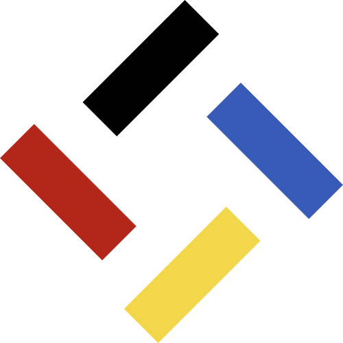

 

# Мавка

Сучасна українська мова програмування.

## Встановлення

Через NPM:

```shell
npm i -g mavka
```

## Використання

```shell
мавка
```

## Ресурси

- [джеджалик](https://gitlab.diia.dev/mavka/jejalyk) - компілятор Мавки
- [мавка.укр](https://мавка.укр) - офіційний вебсайт
- [пак.укр](https://пак.укр) - паки Мавки
- [фрагмент.укр](https://фрагмент.укр) - фрагменти Мавки
- [конкурс.укр](https://конкурс.укр) - конкурси Мавки

## Розробка

Вимоги:

- NodeJS 18+
- NPM

Встановлення:

```shell
git clone https://github.com/mavka-ukr/mavka

cd mavka

npm install
```

Тести:

```shell
npm test
```